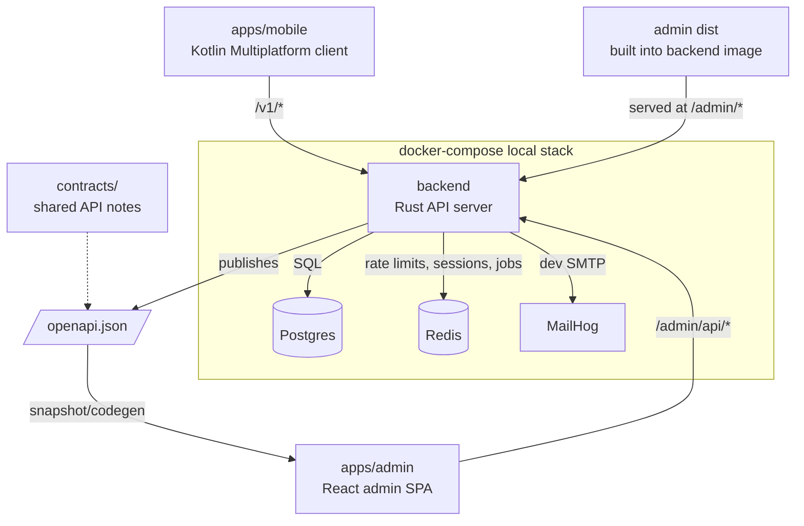

# monorepo-template

Monorepo template for a Rust backend, Kotlin Multiplatform Android client, and backend-shipped React admin console.

## Layout

```text
backend/                 Rust API server, migrations, Dockerfile, production docs
apps/admin/              React/Vite admin console for /admin/*
apps/mobile/             Kotlin Multiplatform mobile client
contracts/               Shared API contracts and behavior notes
docs/                    Product-level architecture and workflow docs
ops/                     Deployment and runtime glue
.github/workflows/       Path-filtered CI/CD workflows
.claude/agents/          Project-level agent instructions
```

## Architecture





## Local Development

The root `justfile` is the main entrypoint:

```sh
just --list
just dev
just backend-test
just admin-dev
just mobile-test
```

The imported subprojects keep their own README files for stack-specific details.

## Artifact Ownership

- The backend image is built with `backend/Dockerfile` from the repository root context so it can include the admin build.
- The admin UI lives in `apps/admin/` and is built into the backend image for production.
- The mobile app is built from `apps/mobile/` and released separately.
